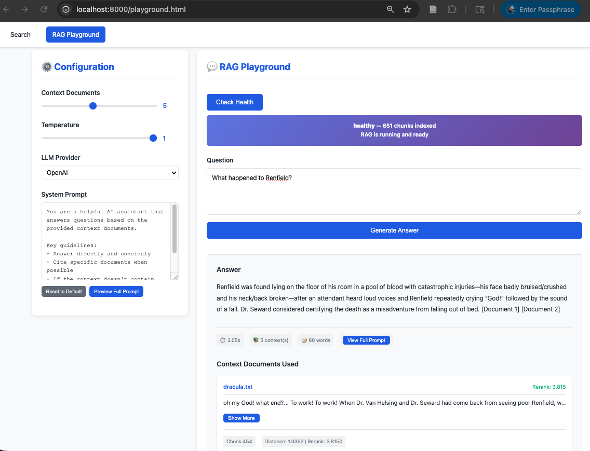
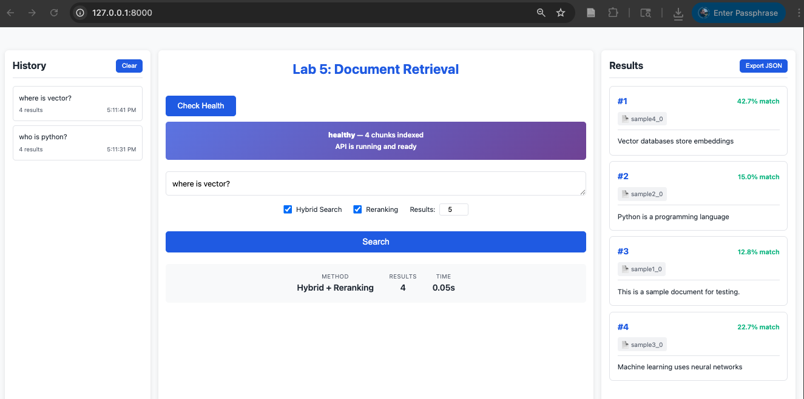

# L6: Rookie RAG System

RAG system using ChromaDB, sentence transformers, and Ollama<br>for [ARIN 5360 at Seattle University](https://catalog.seattleu.edu/preview_course_nopop.php?catoid=55&coid=190380)
Includes chunking, support for PDF files, and LLM integration.

## CI/CD Status
[](https://github.com/cander67/L5/actions/workflows/ci.yml)

## Feature Progression

| Feature | Lab 3 | Lab 4 | P2 | L5 | L6 |
|---------|-------|-------|-----|-----|-----|
| **Text file support** | ✅ | ✅ | ✅ | ✅ | ✅ |
| **PDF support** | ❌ | ✅ | ✅ | ✅ | ✅ |
| **Document chunking** | ❌ | ✅ | ✅ | ✅ | ✅ |
| **Semantic search** | ✅ | ✅ | ✅ | ✅ | ✅ |
| **Cross-encoder reranking** | ❌ | ❌ | ✅ | ✅ | ✅ |
| **Keyword search (BM25)** | ❌ | ❌ | ✅ | ✅ | ✅ |
| **Hybrid search (RRF)** | ❌ | ❌ | ✅ | ✅ | ✅ |
| **Chat History** | ❌ | ❌ | ❌ | ✅ | ✅ |
| **Export History** | ❌ | ❌ | ❌ | ✅ | ✅ |
| **RAG System** | ❌ | ❌ | ❌ | ❌ | ✅ |
| **LLM Integration** | ❌ | ❌ | ❌ | ❌ | ✅ |

### New Features in L6

- **RAG System**: Integrates retrieval-augmented generation using ChromaDB, sentence transformers, and Ollama
- **LLM Integration**: Uses Ollama or OpenAI for generating responses based on retrieved documents

### New Features in L5

- **Chat History**: Track and display previous queries and results
- **Export History**: Save chat history as JSON for future reference

### New Features in P2

- **BM25 Keyword Search**: Traditional keyword matching using BM25 algorithm
- **Reciprocal Rank Fusion**: Combines semantic and keyword results
- **Benefit**: Captures both semantic similarity and exact keyword matches
- **Implementation**: Uses a cross-encoder model to rerank initial search results
- **Benefit**: Improves relevance by considering query-document interaction
- **Model**: `cross-encoder/ms-marco-MiniLM-L-6-v2`

### New Features in Lab 4

- **PDF Support**: Load and index PDF documents alongside text files
- **Document Chunking**: Automatically split large documents into overlapping chunks for better retrieval
- **Improved Metadata**: Track document type, chunk information, and source files

### Features in Lab 3

- **Semantic Search**: Use sentence transformers to encode documents and perform semantic search


## Setup
### Requirements
- Python 3.11
- [uv](https://docs.astral.sh/uv/)

### Optional Requirements
- OpenAI API key (if using OpenAI LLM)

### Installation
```bash
# Install dependencies
uv sync
```
- Create a `.env` file based on `.env.example` if needed that includes your API keys and GitHub Secrets

### Checking Out Assignment Code

Each assignment corresponds to a version tag:

| Assignment | Version | Git Tag               |
|------------|------------|-----------------------|
| Lab 3 | 1.0.0      | lab3_final _(sic)_    |
| Lab 4 | 2.0.0      | lab4-final            |
| Project 2 (required) | 3.0.0      | p2-required-final     |                 
| Project 2 (extra credit) | 3.1.0      | p2-extra-credit-final |
| Lab 5 | 4.0.0      | l5-final           |
| Lab 6 | *Not released* | L6 |

Use `git checkout <tag>` to access that assignment's code.

## Running the Server

```bash
uv run uvicorn src.retrieval.main:app --reload
```

Server starts at http://localhost:8000

## Usage

**Web Interface:** Visit http://localhost:8000

**API:**
```bash
# Health check
curl http://localhost:8000/health

# Basic Semantic Search
curl -X POST http://localhost:8000/search \
  -H "Content-Type: application/json" \
  -d '{"query": "machine learning", "n_results": 5}'

# RAG query with custom system prompt and LLM provider
curl -X POST http://localhost:8000/rag \
  -H "Content-Type: application/json" \
  -d '{
    "question": "What is machine learning?",
    "n_context_docs": 5,
    "temperature": 0.5,
    "system_prompt": "You are a helpful AI assistant.",
    "llm_provider": "ollama"
  }'
```

### Compare Approaches
```python
# Baseline: Semantic only
baseline = DocumentRetriever(use_reranking=False, use_hybrid=False)

# Required: With reranking (default)
with_rerank = DocumentRetriever(use_hybrid=False)

# Extra Credit: Full system by default
full_system = DocumentRetriever()

# Compare results for same query
query = "machine learning algorithms"
results_baseline = baseline.search(query)
results_rerank = with_rerank.search(query)
results_full = full_system.search(query)
```

## CI/CD Instructions
For local development run tests, linter, and type checker using the terminal commands below. For CI/CD, these steps are automated in the GitHub Actions workflow defined in `.github/workflows/ci.yml`.

### Code Quality

```bash
# Check formatting
uv run ruff format --check .

# Format code
uv run ruff format .

# Lint
uv run ruff check .
```

### Type Checking

```bash
# Type check with mypy
uv run mypy src
```

### Testing

```bash
# Run all tests with coverage
uv run pytest

# Run with coverage report
uv run pytest --cov=src/retrieval --cov-report=html

# Smoke test only
uv run pytest tests/test_smoke.py

# Integration test demonstrating p2 feature effectiveness
uv run pytest tests/test_p2_reranking.py -v -s
uv run pytest tests/test_p2_hybrid.py -v -s
```

## Project Structure

```
L6/
├── .github/
│   └── workflows/
│       └── ci.yml         # GitHub Actions for CI/CD
├── .env.example           # Environment variable template
├── src/retrieval/         # Source code
│   ├── embeddings.py      # Document embedder
│   ├── hybrid.py          # Hybrid searcher
│   ├── llm.py             # NEW: LLM interface
│   ├── loader.py          # Document loader
│   ├── main.py            # FastAPI application
│   ├── rag.py             # NEW: RAG pipeline
│   ├── retriever.py       # Main retriever
│   ├── reranker.py        # Document reranker
│   └── store.py           # Vector store
├── tests/                 # Test files
│   ├── test_*.py          # Unit and integration tests
│   ├── test_llm.py        # NEW: Tests for LLM interface
│   ├── test_rag.py        # NEW: Tests for RAG pipeline
│   └── data/              # Documents used in tests
├── static/                # Web interface
│   ├── index.html         # Semantic search interface
│   ├── playground.html    # NEW: RAG interface
│   ├── playground.js      # NEW: RAG interface script
│   ├── search.js
│   └── style.css
├── documents/             # Sample documents
└── pyproject.toml         # Project configuration
```

## Architecture

### Core Components (from Labs 3-4)
- **Loader**: Handles .txt and .pdf files with intelligent chunking
- **Embedder**: Bi-encoder for initial semantic search (all-MiniLM-L6-v2)
- **Store**: ChromaDB for efficient vector search

### P2 New Components
- **Reranker**: Cross-encoder for precise relevance scoring
- **BM25Searcher**: Keyword-based search using BM25 algorithm
- **HybridSearcher**: Combines results using Reciprocal Rank Fusion

## Retrieval Pipeline

### Standard (With Reranking)
1. Semantic search retrieves top 20 candidates
2. Cross-encoder reranks candidates
3. Return top 5 most relevant

### With Hybrid Search
1. Semantic search retrieves top 20 candidates
2. BM25 search retrieves top 20 keyword matches
3. Reciprocal Rank Fusion combines both result sets
4. Cross-encoder reranks fused results
5. Return top 5 most relevant

## RAG Pipeline
1. User can design a query with the interactive prompt review modals
2. Uses semantic search to retrieve relevant documents
3. Generates answers using a language model based on retrieved documents
4. Returns the generated answer to the user with source references

## Key Implementation Details

### Why Rerank?
Bi-encoders (used in initial search) encode query and documents independently. Cross-encoders consider query-document interaction, giving more accurate relevance scores but at higher computational cost. We use bi-encoders for fast candidate retrieval, then cross-encoders for precise reranking.
#### References
* Cross-Encoders: [Reimers & Gurevych (2019) - Sentence-BERT](https://arxiv.org/abs/1908.10084)

### Why Hybrid?
Semantic search excels at understanding meaning but may miss exact keyword matches. BM25 captures keyword overlap but ignores semantics. RRF combines both approaches, leveraging their complementary strengths.

### Why RAG?
RAG (Retrieval-Augmented Generation) combines the strengths of information retrieval and generative AI. It allows the system to provide accurate and contextually relevant answers by first retrieving pertinent documents and then generating responses based on that information.

### Prompt Design
The UI for tracking search history, and designing and reviewing prompts before submission should enable users to create effective prompts that guide the language model to generate accurate and relevant responses.

#### References
| Algorithm | Paper                                                                                                                                           |
|:----------|:------------------------------------------------------------------------------------------------------------------------------------------------|
| BM25 | [Robertson & Zaragoza (2009) - The Probabilistic Relevance Framework](https://www.staff.city.ac.uk/~sbrp622/papers/foundations_bm25_review.pdf) |
| RRF | [Cormack et al. (2009) - Reciprocal Rank Fusion](https://plg.uwaterloo.ca/~gvcormac/cormacksigir09-rrf.pdf)                                     |
### Chunking Strategy

Documents are automatically chunked if they exceed 500 characters:
- **Chunk Size**: 300 words per chunk
- **Overlap**: 30 words between consecutive chunks
- **Benefits**: Better retrieval of specific information in long documents

## Adding Documents

Place .txt or .pdf files in the `documents/` directory and restart the server. Documents are indexed automatically on startup.

## Screenshots
L6 in action!


L5 in action!


## Acknowledgements
- GitHub copilot for inline code suggestions
- Claude Sonnet 4.5 and GPT 5.2 for code suggestions (llm.py, test_llm.py, rag.py, test_rag.py)
- Claude Sonnet 4.5 for html, css, and javascript suggestions (playground.html, playground.js, styles.css)
- Claude Sonnet 4.5 and GPT 5.2 for checking each other's work

